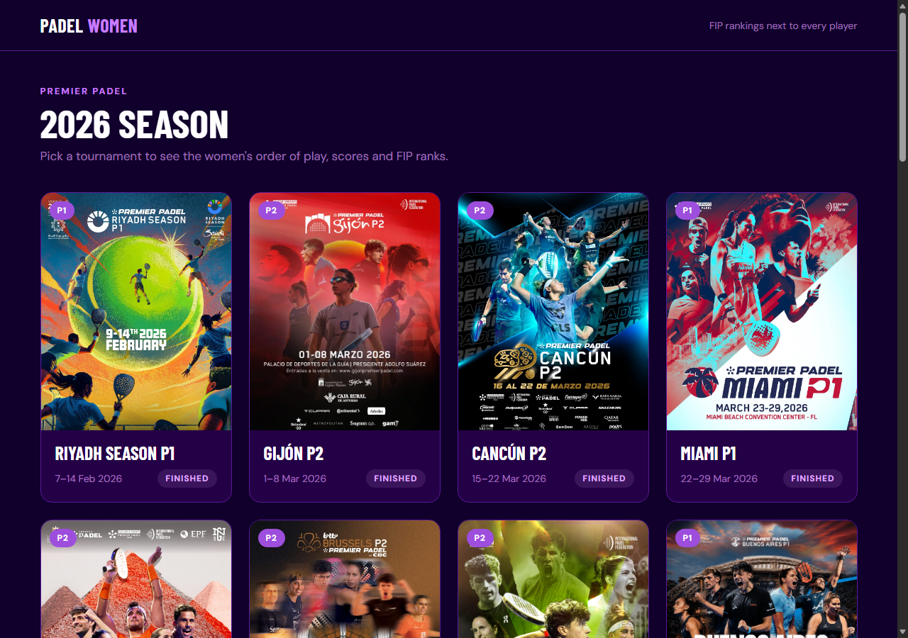
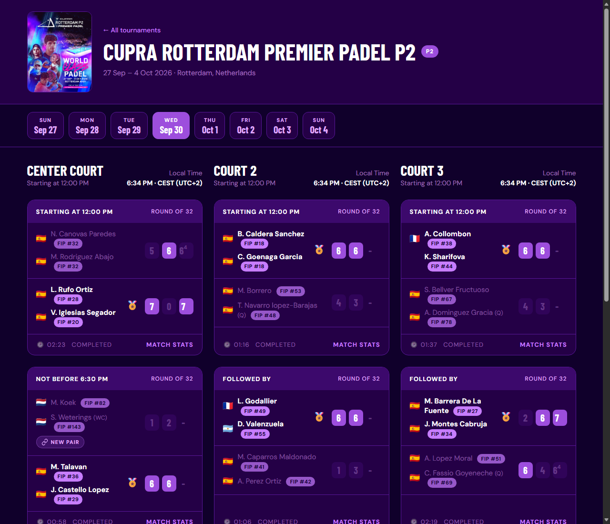
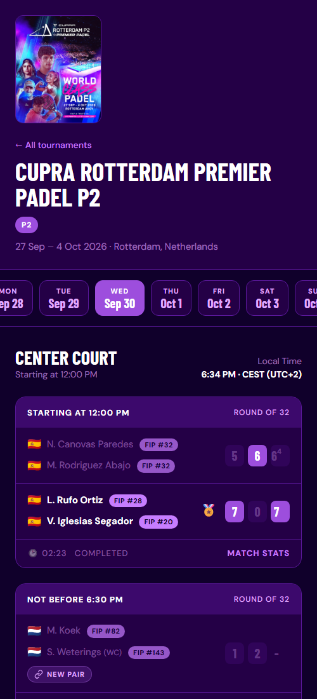

# FIP Padel Order of Play Viewer

A Python tool that fetches live tournament data from the FIP match widget and generates a multi-day HTML page with FIP rank badges injected into the widget's own native design.

**No PDF browser automation. No headless browser. Pure `requests` + `BeautifulSoup` + `pdfplumber`.**

---

## Screenshots

**Landing page** — one poster card per tournament (tier, dates, status):



**Tournament page** — header, day pills, one column per court; FIP rank pills, NEW PAIR badge, flags and winner medals:



**Narrow screen** — courts stack into a single column:



---

## What It Does

1. Fetches the Women's Order of Play widget HTML from `matchscorerlive.com` for each tournament day (up to and including today)
2. Strips the widget's own date navigation, inline `<style>` tags, and modal; filters to Women's matches only
3. Downloads and parses the official tournament Entry List PDF to extract player FIP rankings
4. Injects clickable `FIP #N` rank badges directly into the widget's native HTML
5. Generates a single-page HTML file using the widget's own CSS — no custom card design
6. In `--watch` mode, re-fetches only today's day every 60 s (15 s when a live match is detected)

---

## Output

- **Landing page** — a grid of tournament cards: poster (from the event page's `og:image`, court-drawing fallback), tier, dates and status (Finished / Live / Upcoming)
- **Tournament header** — poster thumbnail, "← All tournaments", name, tier and dates · city
- **Date navigation bar** — one pill per tournament day (scrolls sideways on phones); the most recent day with Women's matches is active by default
- **Match cards** — the widget's original HTML, restyled only through CSS (`output/assets/overrides.css`); rank badges, NEW PAIR badges and emoji are the only added elements. Cards in the same row are equally tall
- **FIP rank badges** — `FIP #N` pills linking to the player's padelfip.com profile in a new tab; only shown when a rank is found (no N/A badge for unranked players)
- **NEW PAIR badges** — a `NEW PAIR` pill under a team whose players had a different partner in the most recent previous tournament they entered; hover or Tab to it to see who (`Previously with M. Calvo` / `at Buenos Aires P1`). Not shown in the first tournament of the season
- **Emoji** — a flag per player, 🏅 next to the winners of every completed match, 👑 next to the winners of the final (Noto Color Emoji, so flags also render on Windows)
- **Live Local Time** — the widget's static "Local Time" field is overwritten by a JavaScript clock showing the current time at the tournament venue with its time zone (`6:34 PM · CEST (UTC+2)`; offset only where the browser knows no abbreviation), DST included, updating every 30 seconds without a page reload
- **Design tokens** — every color, font and spacing value is a CSS variable in `output/assets/theme.css`; change one and the whole site follows
- **Empty-day messages** — "No Women Matches" / "No Schedule Available" for days with no published schedule
- **Auto-refresh** — 60 s normally; drops to 15 s automatically when a live match is detected
- **DINPro fonts** — downloaded once to `output/fonts/` and loaded locally; bypasses the widget server's CORS restriction

---

## Project Structure

```
FIP_Project/
├── main.py                  # Entry point — orchestrates all steps + watch/serve loop
├── scrape_matches.py        # Fetches widget HTML; body extraction, gender filter, match parser
├── scrape_rankings.py       # Downloads entry list PDF + name-matching logic
├── generate_html.py         # Injects rank badges; assembles multi-day HTML output
├── tournaments.py           # Loads data/tournaments.json; picks the tournament to generate
├── partnerships.py          # Partner change tracking from the entry list PDFs (NEW PAIR badge)
├── discover_tournaments.py  # Standalone: finds every Premier Padel tournament of a season
├── CLAUDE.md                # Guidance for Claude Code
├── requirements.txt
├── data/
│   ├── cache/<slug>/entry_list.json  # Cached PDF rankings per tournament (refreshed every 24 hours)
│   ├── cache/<slug>/matches.json     # Frozen match data of a finished tournament (never re-fetched)
│   ├── tournaments.json       # Season tournament list (written by discover_tournaments.py)
│   ├── partnerships.json      # Every pair of every tournament (built from the entry list PDFs)
│   └── pdfs/<slug>/entry_list_women.pdf  # Local copies of the women's entry lists
└── output/
    ├── index.html           # Landing page: card grid of all tournaments
    ├── <slug>/index.html    # One Order of Play page per tournament
    ├── assets/theme.css     # Design tokens (CSS variables) — linked by every page
    ├── assets/overrides.css # Match-card restyling, scoped under .fip-theme
    └── fonts/               # DINPro font files (downloaded once, shared by all pages)
        ├── DINPro-CondensedRegular.woff
        ├── DINPro.woff
        └── DINPro-Black.woff
```

---

## Installation

```bash
pip install -r requirements.txt
```

**requirements.txt**
```
requests
beautifulsoup4
unidecode
pdfplumber
```

---

## Usage

```bash
# Recommended: live mode with HTTP server (no browser caching, auto-refresh)
python main.py --serve --watch --open

# Live mode via file:// (simpler, but browser may cache aggressively)
python main.py --watch --open

# Single run — generate once and open
python main.py --open

# Single run — force re-download of entry list PDF (bypass 24 h cache)
python main.py --force-refresh --open

# Every tournament of the season + landing page
python main.py --all --open
python main.py --all --serve --watch --open   # ...and keep the ongoing tournament live
```

### All tournaments (`--all`)

`--all` generates `output/<slug>/index.html` for every tournament in `data/tournaments.json`
and a landing page at `output/index.html` listing them with name, tier, dates and status
(Finished / Ongoing / Upcoming / Postponed / No data). Each tournament page has a small
"← All tournaments" link back to it.

- **Finished tournaments** are fetched once and frozen in `data/cache/<slug>/`; later runs make
  no HTTP requests for them. `--force-refresh` re-fetches them.
- **Upcoming tournaments** appear on the landing page without a link; their page is generated
  once the schedule is published.
- Without `--all`, one tournament page is written to `output/<slug>/index.html`. Use
  `--output FILE` to write a standalone page somewhere else.

### How `--watch` works

- **First run**: fetches all tournament days (8 HTTP requests for an 8-day tournament), builds full state in memory
- **Each subsequent cycle**: fetches **only today's day** of a tournament that is still being played (1 HTTP request), updates state in place, rewrites HTML. Finished and upcoming tournaments are not refreshed
- **Live match detected** (`img.ballg` present in widget): refresh interval drops from 60 s → 15 s automatically; the `<meta http-equiv="refresh">` in the HTML is rewritten each cycle to match

### How `--serve` works

Starts a local HTTP server on `http://localhost:8080/` in a daemon thread. Serves the `output/` directory (`/` = landing page, `/<slug>/` = tournament page) with `Cache-Control: no-store, no-cache` headers so the browser always picks up the freshly regenerated file. Combine with `--watch` for fully live updates.

---

## How It Works

### Step 1 — Match Scraping (`scrape_matches.py`)

Only days up to and including today are fetched. For each active day one HTTP request is made directly to the widget:

```
GET https://widget.matchscorerlive.com/screen/oopbyday/FIP-{year}-{id}/{day}?t=tol
```

The widget body is then cleaned:

| Operation | Detail |
|---|---|
| Strip `<script>` tags | Removes widget's own JS |
| Strip `<style>` tags | Removes inline CSS overrides — card styling is in the linked CSS files |
| Remove `div.sticky-top.day-selector` | Strips the widget's built-in date navigation |
| Remove `div.modal` | Removes the video/livestream popup |
| Make relative URLs absolute | `src="/images/..."` → `https://widget.matchscorerlive.com/images/...` |
| Filter to Women's matches | Removes `<table class="w-100">` blocks where `<b>` ≠ "Women"; removes empty court columns |
| Return fragment (not full document) | `body_el.decode_contents()` — prevents BeautifulSoup wrapping fragments in `<html><body>` tags |
| Wrap in `<div class="m-3">` | Preserves the widget body's original margin class |

**Resilience:** each day is retried up to 3 times (3 s between attempts). 404 responses are not retried. Watch-loop partial updates use `fetch_one_day()` which applies the same retry logic.

---

### Step 2 — Rankings from Entry List PDF (`scrape_rankings.py`)

The official tournament entry list PDF is downloaded and parsed with `pdfplumber`:

```
GET https://www.padelfip.com/wp-content/uploads/.../Entry-list-....pdf
```

The PDF lists player pairs in a 3-line repeating pattern:

```
Delfina Brea Senesi ARG Gemma Triay Pons ESP
1 1 1 35320
17660 points 17660 points
```

Results are cached to `data/cache/<slug>/entry_list.json` and reused for 24 hours.

If parsing returns 0 players, run the debug helper:
```bash
python -c "from scrape_rankings import _debug_pdf_rows; _debug_pdf_rows()"
```

#### Name Matching

Widget names are abbreviated (`A. Sanchez Fallada`); PDF entries are full names (`Ariana Sanchez Fallada`). A contiguous sub-sequence index handles compound last names:

```
"Martina Calvo Santamaria"  →  keys: ("m", "calvo santamaria"), ("m", "calvo"), ("m", "santamaria")
```

---

### Step 3 — Rank Badge Injection (`generate_html.py`)

Each day's cleaned widget body HTML is processed by `inject_rank_badges()`:

1. Find every `<div class="line-thin">` (the widget's player name container)
2. Read `spans[0]` (first initial) + `spans[1]` (last name) → look up via `match_player()`
3. If a rank is found, append `<a class="fip-rank-badge" href="{profile_url}" target="_blank">FIP #{rank}</a>`
4. If no rank found, leave the player row untouched (no N/A badge)

---

### Step 4 — HTML Assembly (`generate_html.py`)

Custom CSS is minimal — all match card styling comes from the widget's own linked CSS files.

| Custom class / rule | Purpose |
|---|---|
| `.fip-rank-badge` | Gold rank badge styling |
| `.fip-date-nav` | Date navigation bar — `flex-wrap: nowrap; flex-shrink: 0` prevents nav shrink on content-heavy days |
| `.fip-day-btn` / `.fip-day-panel` | Day tab show/hide |
| `.fip-empty-day` | Centred message for days with no matches or no schedule |
| `body` flex + `min-height: 100vh` | Sticky footer — `min-height` (not `height`) avoids capping body to viewport |
| `@font-face` (DINPro) | Local font declarations (overrides widget's cross-origin-blocked declarations) |

**JavaScript** (embedded `<script>`):
- Tab switching — clicking a day button shows that day's panel
- Venue live clock — overwrites all `.local-time` elements with the time in the tournament's time zone (`timezone` in `data/tournaments.json`) every 30 seconds; format: `H:MM AM/PM`; no page reload required

---

## Configuration

Tournaments are read from `data/tournaments.json` — no constants to edit.

```bash
python main.py --tournament buenos-aires-p1-2026 --open   # a specific tournament
python main.py --open                                      # the one being played today, else the most recent
```

`--tournament` takes a slug from `data/tournaments.json`. The file is created by the
discovery script below; run it once per season (and again to pick up new entry lists).

### Tournament discovery (`discover_tournaments.py`)

Standalone script that lists every Premier Padel tournament of a season and writes the
`data/tournaments.json` used by `main.py`.

```bash
python discover_tournaments.py --year 2026                               # whole season
python discover_tournaments.py --year 2026 --only buenos-aires-p1-2026   # one tournament
python discover_tournaments.py --year 2026 --overwrite                   # let the site replace existing values
```

It writes `data/tournaments.json` (slug, name, tier, tournament ID, dates, total days,
status, location, time zone, entry list PDF URL) and saves each women's entry list PDF under `data/pdfs/<slug>/`.
Re-running merges with the existing JSON: values already in the file are kept, so manual
edits survive unless `--overwrite` is passed. `status` (finished / ongoing / upcoming / postponed) is always recomputed.

### Partner changes (`partnerships.py`)

Pairs are read from the entry list PDFs saved by the discovery script and stored in
`data/partnerships.json`. For each team on a match card, each player's partner is compared with
her partner in the most recent earlier tournament she entered; if it differs the team gets a
`NEW PAIR` badge. The file is rebuilt automatically when a PDF changes.

```bash
python partnerships.py   # rebuild and print every partner change per tournament
```

If a player on a card cannot be matched to the entry list (e.g. a wild card that is not in the
PDF), no badge is shown for that team.

---

## Sample Run Output

```
========================================================
  FIP Order of Play Generator
  Tournament : Premier Padel Buenos Aires P1 2026 — Women
  Output     : output/index.html
========================================================

-- Step 1: Fetching match data (up to today) -----------
[scrape_matches] Today = tournament day 7 (2026-05-16)
[scrape_matches] Fetching day 1/7...
[scrape_matches]   Collected 6 widget stylesheet(s)
[scrape_matches]   Day 1: 0 Women match(es) (total parsed: 16)
...
[scrape_matches]   Day 7: 2 Women match(es) (total parsed: 4)
[scrape_matches]   Day 8: skipped (future date)
         40 match(es) across 6 day(s)
         6 widget stylesheet(s) collected

-- Step 2: Loading rankings from entry list PDF --------
[rankings] Using cached entry list (data\cache\buenos-aires-p1-2026\entry_list.json)
         150 players in rankings cache

-- Step 3: Injecting rank badges into widget HTML ------
         Rank badges injected for 6 day(s)

-- Step 4: Generating HTML -----------------------------
[html] Saved -> ...\output\index.html

========================================================
  Done!  ->  ...\output\index.html
========================================================

[serve] HTTP server started → http://localhost:8080/
[watch] Live mode active — press Ctrl+C to stop.
[watch] Updating day 7...
[watch] Day 7 updated — next update in 60 s
```

---

## Notes

- **Windows encoding**: Set `PYTHONUTF8=1` or run `python -X utf8 main.py` if you see encoding errors in the terminal. The HTML output is always written as UTF-8.
- **Fonts**: Downloaded once to `output/fonts/` and reused on subsequent runs. Delete the folder to force re-download.
- **PDF format**: If a future tournament uses a different PDF layout, run `python -c "from scrape_rankings import _debug_pdf_rows; _debug_pdf_rows()"` to inspect raw extracted lines and tune the regex constants in `scrape_rankings.py`.
- **Widget structure dependency**: The badge injector targets `div.line-thin`. If `matchscorerlive.com` changes their HTML structure, this selector may need updating.
- **Local Time field**: The widget server embeds a static timestamp in `<div class="local-time">` at fetch time. The embedded JavaScript clock overwrites this with a live Buenos Aires clock — no page reload needed between 30-second updates.

## Disclaimer
This tool fetches data from matchscorerlive.com's public widget and the official FIP tournament entry lists. Use responsibly and in accordance with their terms of service.